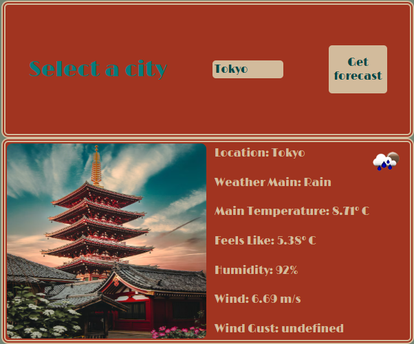
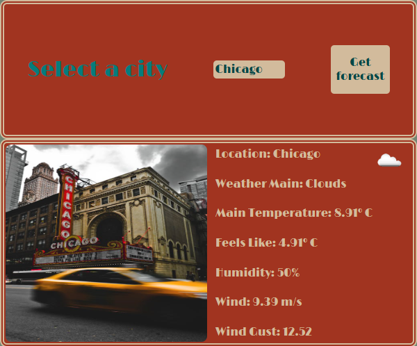

# Ejercicio de práctica:

- Aplicacion  que proporciona información meteorológica de diferentes ciudades.
- Uso de API metereológica para el Fetch.
- 6 ciudades en concreto de las cuales una de ellas, Paris, no recibe información válida desde la API. Manejo del error.
  
